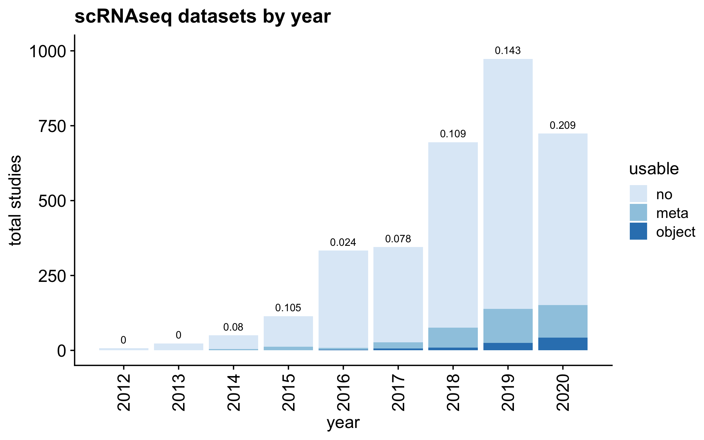
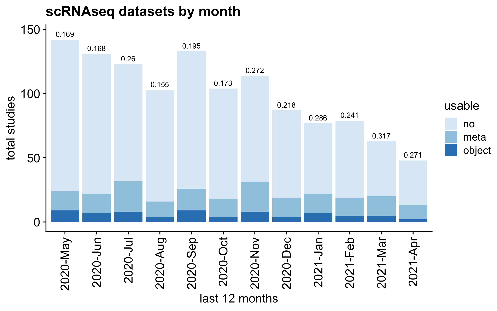

# someta 

<!-- badges: start -->

<!-- badges: end -->

Cell-type annotations are frequently excluded from public single cell
datasets. This hinders single cell sequencing analysis reproducibility
and accessibility. To better describe the issue, we monitor GEO entries
monthly (currently set to auto-update at 1AM UTC, 20th of the month),
and programmatically determine the fraction of entries with
(potentially) usable cell metadata.

As of the initial presentation of this issue (10–17–2020), the number is
a frustratingly low **0.122**.

We have written up descriptions of the issue and suggestions (in short:
PLEASE deposit some metadata at cell level for scRNA-seq data) in this
short
[manuscript](https://www.biorxiv.org/content/10.1101/2020.11.20.391920v1).

Please find the latest numbers below, or at [full report
page](https://rnabioco.github.io/someta/articles/get_geo.html).

The latest archive of GEO scRNA-seq records with other associated data
can be directly downloaded here
[current\_geo.rds](https://github.com/rnabioco/someta/raw/master/inst/extdata/current_geo.rds)

Additional thoughtful guidelines for organizing scRNA-seq sample and
cell metadata are discussed here by [Füllgrabe et
al](https://www.nature.com/articles/s41587-020-00744-z).

Current fraction with metadata: **0.1277746**.

Number of depositions with updated metadata records since description of
the issue here: **0**.

<!-- --><!-- -->
