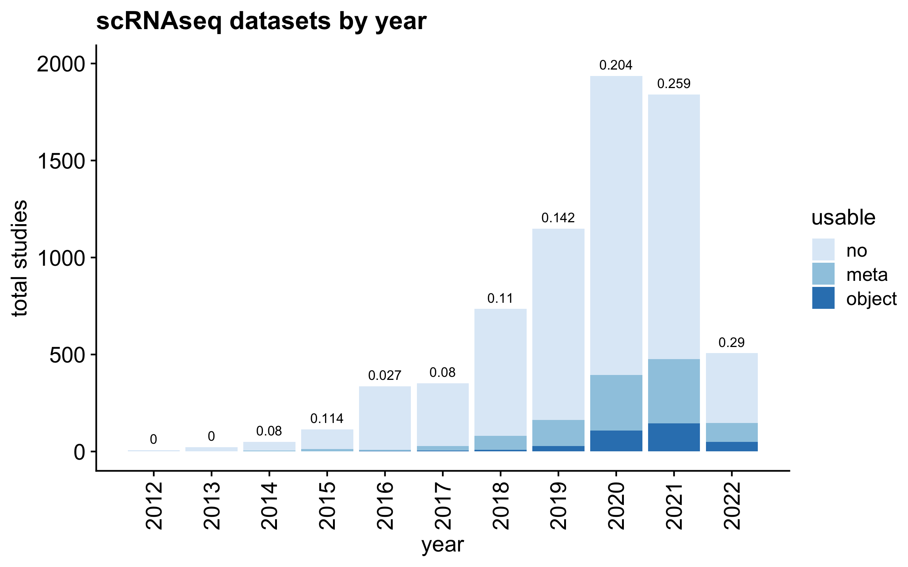
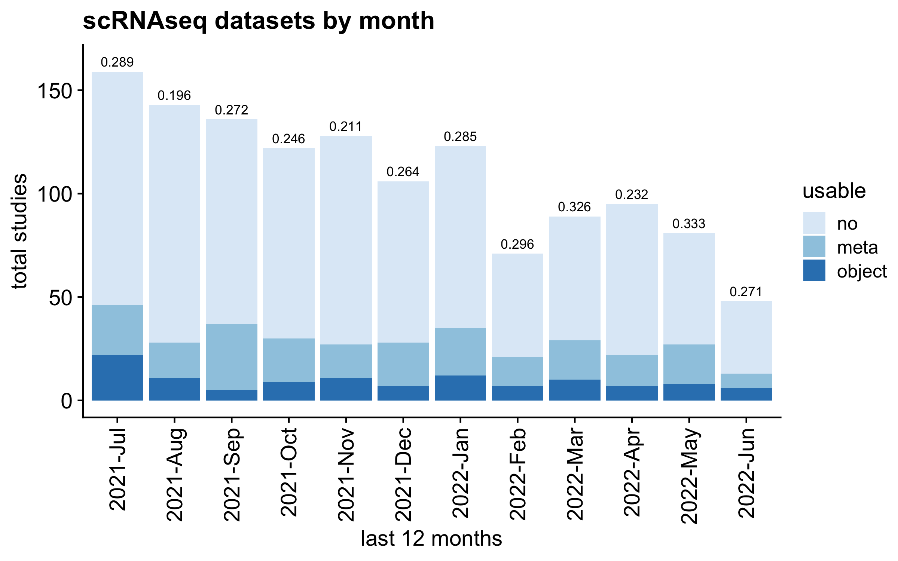

# scmetadata

<!-- badges: start -->

<!-- badges: end -->

Cell-type annotations are frequently excluded from most public single
cell datasets. This hinders single cell sequencing analysis
reproducibility and accessibility. To better describe the issue, we
monitor GEO entries monthly, and programmatically determine the fraction
of entries with usable cell metadata.

As of the initial presentation of this issue (10–17–2020), the number is
a frustratingly low 0.122.

Please find the latest numbers below, or at [report
link](https://rnabioco.github.io/scmetadata/articles/get_geo.html).

Final fraction with (potentially usable) metadata: 0.1223616

<!-- --><!-- -->
